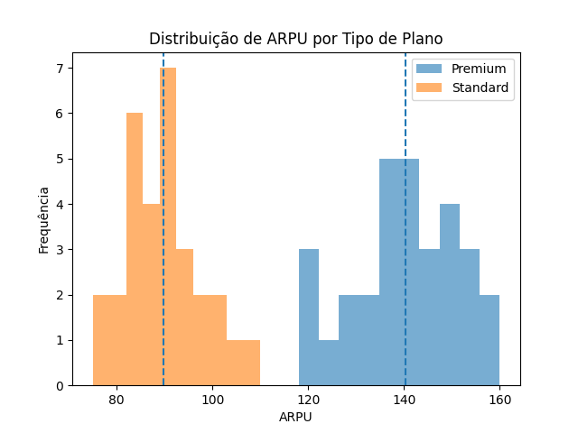

[](https://github.com/aestevaomoraes)


# 📊 Telecom Revenue Analysis (T-Test)

## 🎯 Business Problem

In telecom companies, understanding customer revenue behavior is essential.

This project aims to answer the following question:

👉 Do customers with a premium plan generate higher average revenue (ARPU)
compared to customers with a standard plan?

---

## 📦 Dataset

- Type: Simulated dataset (realistic scenario)
- Records: 60 customers
- Features:

| Column        | Description                         |
|--------------|-------------------------------------|
| customer_id  | Unique customer identifier          |
| plan_type    | Customer plan (premium / standard)  |
| arpu         | Average Revenue Per User            |

---

## 🧠 Approach

This analysis provides strong evidence to support strategic decisions such as:

1. Data loading and validation  
2. Exploratory Data Analysis (EDA)  
3. Data visualization  
4. Hypothesis testing (t-test)  
5. Business interpretation  

---

## 🧹 Data Preparation

- No missing values found  
- Balanced dataset (30 premium / 30 standard)  
- Correct data types  

---

## 📊 Exploratory Data Analysis

Average ARPU by group:

- Premium: **140.30**
- Standard: **89.87**

👉 Initial indication: premium customers generate more revenue.

---

## 📈 Data Visualization

A histogram was used to compare the distribution of ARPU between groups.

### ARPU Distribution by Plan Type



### Key observations:

- Premium customers are concentrated at higher ARPU values  
- Standard customers are concentrated at lower values  
- Minimal overlap between distributions  

👉 Visual evidence suggests a strong difference between groups.

---

## 🧪 Hypothesis Testing

### Hypotheses

- H₀: μ_premium = μ_standard  
- H₁: μ_premium > μ_standard  

### Test used

- Independent t-test (Welch’s t-test)

### Results

- t-statistic: **19.80**
- p-value: **3.49e-26**

---

## ✅ Conclusion

The p-value is extremely small (≈ 0), indicating that the observed difference
is statistically significant and highly unlikely to have occurred by chance.

👉 We reject the null hypothesis (H₀).

### Final Insight:

Customers with premium plans generate significantly higher average revenue (ARPU)
compared to standard plan customers.

---

## 💼 Business Impact

This analysis supports strategic decisions such as:

- 📈 Upsell strategies (migrating users to premium plans)
- 💰 Revenue optimization
- 🎯 Customer segmentation
- 📊 Marketing targeting

---

## ⚙️ Tech Stack

- Python
- Pandas
- SciPy
- Matplotlib

---

## 📌 Key Takeaway

Premium customers represent a higher-value segment,
and focusing on their growth can significantly increase overall revenue.

## 🚀 How to Run

### 1. Clone the repository

```bash
git clone https://github.com/aestevaomoraes/t-test-salary-analysis.git
cd t-test-salary-analysis
